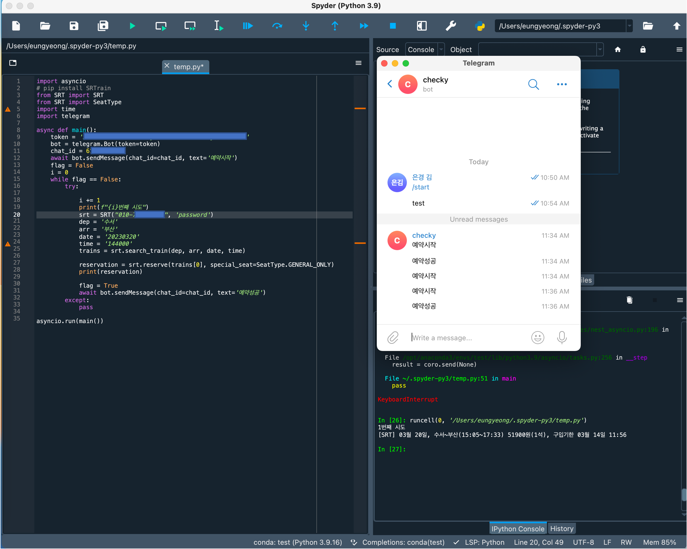

# book_train

## 실행 화면


## 설치해야 할 파일
```
pip install SRTrain
pip install python-telegram-bot
```

## 먼저 해야 할일
### 봇만들기
- BotFather 클릭해서 채팅방 들어가기


- /newbot 입력 또는 클릭해서 봇 만들기


- 봇 이름 설정해 주기


- 봇 username 설정해 주기 (여기서 토근값이 중요합니다 )


- get my id 클릭해서 채팅방 들어가기


- /start 입력해서 chat_id 알기
